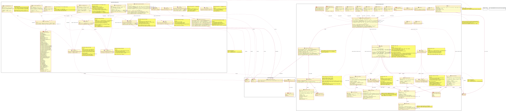

# Rust Diagnostic API Layer - Application Usage

This API layer provides application-facing abstractions for UDS and SOVD diagnostics in Rust.
Applications implement service/resource/operation traits and register them via builder structs.
The resulting `DiagnosticServicesCollection` controls lifetime and keeps the implemented application
functionality connected to the underlying binding.

## Code Generation Guidelines

**Important**: This design is intended for automated code generation. Key constraints:

- **Rust Edition**: 2021+ (minimum required)
- **Async Strategy**: All trait methods are currently **synchronous**. While shown in design for API clarity, the current implementation does not use async. Future versions may add async support using `#[async_trait]` macro.
- **Thread Safety**: Generic type parameters have different bounds based on their access patterns:
  - **Read-only traits** (`ReadDataByIdentifier`, `ReadOnlyDataResource`): Require `Send + Sync + 'static` because immutable `&self` methods allow safe concurrent access from multiple threads
  - **Write-only traits** (`WriteDataByIdentifier`, `WritableDataResource`): Require only `Send + 'static` because `&mut self` methods need exclusive access (no concurrent execution possible, so `Sync` is unnecessary)
  - **Mixed traits** with both `&self` and `&mut self` methods (`DiagnosticEntity`, `Operation`, `DataIdentifier`, `DataResource`): Require `Send + Sync + 'static` because they have immutable methods that could be called concurrently (e.g., `Operation::info(&self)`, `Operation::status(&self)`)
  - **Mutable-only traits** (`RoutineControl`, `UdsService`): Require only `Send + 'static` because they only have `&mut self` methods
- **Trait Objects**: All traits marked with `<<object-safe>>` can be used as `dyn Trait` (e.g., `Box<dyn ReadDataByIdentifier + Send + Sync>`)
- **Feature Flags**: Both "sovd" and "uds" modules are optional and independently toggleable via Cargo features
- **Error Handling**: 
  - `Result<T>` (core/UDS): Uses `ErrorCode` for low-level diagnostic errors
    - Import: `use opensovd_diag::error::{Result, ErrorCode};`
  - SOVD Result type: Uses `Error` for protocol-specific errors
    - **Recommended**: `use opensovd_diag::sovd::{Result, Error};` for direct import when no ambiguity
    - **Alternative**: `use opensovd_diag::sovd::{self, ...};` with `sovd::Result<T>` and `sovd::Error` for explicit module qualification
    - Both approaches work; choose based on context (direct import is simpler, module qualification is clearer when multiple Result types are in scope)
  - No automatic conversion between error types (intentional module isolation)
- **Type Aliases** (UDS):
  - `ByteVec`: Type alias for `Vec<u8>` (owned byte sequences)
  - `ByteSlice`: Type alias for `&[u8]` (borrowed byte slices)
  - Provides semantic clarity for diagnostic data payloads
- **Blanket Implementations**:
  - **Trait Inheritance**:
    - `DataIdentifier`: Auto-implemented for types that implement both `ReadDataByIdentifier` and `WriteDataByIdentifier`
    - `DataResource`: Auto-implemented for types that implement both `ReadOnlyDataResource` and `WritableDataResource`
  - **DiagnosticEntity Smart Pointers** (provided by crate, no feature flags needed):
    - `impl<T: DiagnosticEntity> DiagnosticEntity for &T`
    - `impl<T: DiagnosticEntity> DiagnosticEntity for &mut T`
    - `impl<T: DiagnosticEntity> DiagnosticEntity for Box<T>`
    - `impl<T: DiagnosticEntity> DiagnosticEntity for Arc<T>`
    - `impl<T: DiagnosticEntity> DiagnosticEntity for Rc<T>`
    - **Rationale**: Enable flexible ownership patterns in builder's `new<T>(entity: T)` method without runtime overhead
- **Lifetime Management**: SOVD `DiagnosticServicesCollection<'entity>` uses lifetime parameter to support non-'static entity types
  - **Entity Ownership**: Builder takes **ownership** of entity via `new<T: DiagnosticEntity>(entity: T)`
    - **Type erasure happens internally**: Entity is boxed as `Box<dyn DiagnosticEntity + Send + Sync + 'entity>`
    - **No circular dependency**: Builder owns entity, then transfers it to collection during `build()`
    - **Flexible input types**: You can pass `Arc<MyEntity>`, `Box<MyEntity>`, or `MyEntity` directly
    - **Example**: `DiagnosticServicesCollectionBuilder::new(Arc::new(MyEntity::new()))`
    - Collection stores: `Box<dyn DiagnosticEntity + Send + Sync + 'entity>` (no generic type parameter needed)
    - **Performance note**: One `Box` allocation during initialization is acceptable (reviewer confirmed)
    - **Future optimization**: If allocation becomes an issue, use `smallbox` crate (stack allocation for small types)

## Design Goals

- **Abstraction Layer**: Acts as abstraction between user code and a concrete binding implementation which communicates with the SOVD Server.
  - Guarantees clear independence from underlying implementation details, facilitating easy unit-testability
  - Concrete binding implementation can be easily exchanged without adjusting user code

- **SOVD Server Integration**: API layer has necessary information available to forward data to the SOVD Server for further processing.
  - User code provides required information during registration of SOVD Operations and Data Resources

- **Simplified SOVD Payload Creation**: Minimal hassle for creating and populating native SOVD reply payloads.
  - API layer creates native SOVD data structures and populates them from user data structures (e.g., to JSON)

- **Legacy UDS Support**: User code using legacy UDS APIs continues to work seamlessly.
  - Enables step-wise migration to new SOVD APIs, easing system migration to OpenSOVD stack

- **SOVD-First Development**: Newly written applications should use native SOVD APIs instead of legacy UDS APIs.

## Cargo Feature Flags

**Important**: At least one protocol feature must be enabled. The crate enforces this via compile-time assertion and will not compile without it.

- **`sovd`**: SOVD protocol support (recommended for new projects)
- **`uds`**: UDS protocol support (legacy systems)

**No default features** - users must explicitly choose protocol(s) to encourage conscious decision-making and reduce binary bloat.


```toml
# SOVD only
opensovd-diag = { version = "0.1", features = ["sovd"] }

# UDS only
opensovd-diag = { version = "0.1", features = ["uds"] }

# Both protocols
opensovd-diag = { version = "0.1", features = ["sovd", "uds"] }

### Compile-Time Error

If no features are enabled, you'll see:
```
error: At least one protocol feature must be enabled.
Add one of: features = ["sovd"], features = ["uds"], or features = ["sovd", "uds"]
to your Cargo.toml dependency.
```

## SOVD Type Reference

### JSON Schema Support

SOVD resources require JSON schema definitions for protocol compliance. Schemas are provided during resource registration and describe:
- Data structure (object, array, primitive types)
- Field names and types
- Required vs optional fields
- Validation constraints (format, min/max, patterns)

Schemas follow the [JSON Schema](https://json-schema.org/) specification and enable:
- **Protocol Compliance**: SOVD clients know expected data structures
- **Validation**: Automatic request/response validation
- **Documentation**: Auto-generate API documentation
- **Tooling Support**: Better IDE integration and client code generation

### DataCategoryIdentifier

Maps Rust enums to SOVD protocol strings:

| Rust Enum | SOVD String |
|-----------|-------------|
| `DataCategoryIdentifiers::Identification` | `"identData"` |
| `DataCategoryIdentifiers::Measurement` | `"currentData"` |
| `DataCategoryIdentifiers::Parameter` | `"storedData"` |
| `DataCategoryIdentifiers::SysInfo` | `"sysInfo"` |

## Diagrams


A [PlantUML version](./rust_abstraction_layer_api_for_user_applications.puml) is also available.

## Coding Examples

> **Note**: Examples require enabling the appropriate feature flags (`uds` or `sovd`) in your `Cargo.toml`.

### UDS: ReadDataByIdentifier

```rust
use opensovd_diag::uds::{ReadDataByIdentifier, DiagnosticServicesCollectionBuilder};
use opensovd_diag::error::Result;
use opensovd_diag::types::ByteVec;

pub enum VehicleDataIdentifier {
    VehicleIdentificationNumber,
    VehicleSpeed,
    EngineRPM,
}

impl VehicleDataIdentifier {
    pub fn as_uds_did(&self) -> &'static str {
        match self {
            Self::VehicleIdentificationNumber => "0xF190",
            Self::VehicleSpeed => "0x010D",
            Self::EngineRPM => "0x010C",
        }
    }
}

struct VinReader;

impl ReadDataByIdentifier for VinReader {
    fn read(&self) -> Result<ByteVec> {
        Ok(vec![0x56, 0x49, 0x4E])  // "VIN" bytes, example only
    }
}

fn register_vin_reader() -> Result<DiagnosticServicesCollection> {
    DiagnosticServicesCollectionBuilder::new()
        .with_read_did(
            VehicleDataIdentifier::VehicleIdentificationNumber.as_uds_did(),
            VinReader
        )
        .build()
}
```

### UDS: WriteDataByIdentifier

```rust
use opensovd_diag::uds::{WriteDataByIdentifier, DiagnosticServicesCollectionBuilder};
use opensovd_diag::error::Result;
use opensovd_diag::types::ByteSlice;

struct ConfigWriter;

impl WriteDataByIdentifier for ConfigWriter {
    fn write(&mut self, data: ByteSlice) -> Result<()> {
        // parse and persist `data` here
        Ok(())
    }
}

fn register_config_writer() -> Result<DiagnosticServicesCollection> {
    DiagnosticServicesCollectionBuilder::new()
        .with_write_did(
            VehicleDataIdentifier::VehicleSpeed.as_uds_did(),
            ConfigWriter
        )
        .build()
}
```

### UDS: DataIdentifier (Read & Write)

```rust
use opensovd_diag::uds::{ReadDataByIdentifier, WriteDataByIdentifier, DataIdentifier};
use opensovd_diag::error::{Result, ErrorCode};
use opensovd_diag::types::{ByteVec, ByteSlice};

#[derive(Clone)]
struct ConfigData {
    value: u32,
}

impl ReadDataByIdentifier for ConfigData {
    fn read(&self) -> Result<ByteVec> {
        Ok(self.value.to_be_bytes().to_vec())
    }
}

impl WriteDataByIdentifier for ConfigData {
    fn write(&mut self, data: ByteSlice) -> Result<()> {
        if data.len() == 4 {
            self.value = u32::from_be_bytes([data[0], data[1], data[2], data[3]]);
            Ok(())
        } else {
            Err(ErrorCode::InvalidInput("Expected 4 bytes".into()))
        }
    }
}

// DataIdentifier is automatically implemented for types implementing both traits

fn register_config_data() -> Result<DiagnosticServicesCollection> {
    DiagnosticServicesCollectionBuilder::new()
        .with_data_id(
            VehicleDataIdentifier::EngineRPM.as_uds_did(),
            ConfigData { value: 0 }
        )
        .build()
}
```

### UDS: RoutineControl

```rust
use opensovd_diag::uds::{RoutineControl, DiagnosticServicesCollectionBuilder};
use opensovd_diag::error::Result;
use opensovd_diag::types::{ByteVec, ByteSlice};

pub enum VehicleRoutineIdentifier {
    SelfTest,
    EngineCalibration,
    BrakeBleeding,
}

impl VehicleRoutineIdentifier {
    pub fn as_uds_routine_id(&self) -> &'static str {
        match self {
            Self::SelfTest => "0xFF00",
            Self::EngineCalibration => "0xFF01",
            Self::BrakeBleeding => "0xFF02",
        }
    }
}

struct MyRoutine {
    state: u8,
}

impl RoutineControl for MyRoutine {
    fn start(&mut self, params: ByteSlice) -> Result<ByteVec> {
        // implement your logic for start routine here
        self.state = 1;
        Ok(vec![0x00])
    }

    fn stop(&mut self, params: ByteSlice) -> Result<ByteVec> {
        // implement your logic for stop routine here
        self.state = 0;
        Ok(vec![0x00])
    }

    fn request_results(&self, params: ByteSlice) -> Result<ByteVec> {
        // implement your logic for request routine results here
        Ok(vec![0x12, 0x34, self.state])
    }
}

fn register_my_routine() -> Result<DiagnosticServicesCollection> {
    DiagnosticServicesCollectionBuilder::new()
        .with_routine(
            VehicleRoutineIdentifier::SelfTest.as_uds_routine_id(),
            MyRoutine { state: 0 }
        )
        .build()
}
```

### SOVD: ReadOnlyDataResource

```rust
use opensovd_diag::sovd::{
    self, ReadOnlyDataResource, DiagnosticServicesCollectionBuilder, 
    DiagnosticEntity, JsonDataReply
};
use serde_json::json;
use std::sync::Arc;

struct VehicleInfoResource;

#[async_trait::async_trait]
impl ReadOnlyDataResource for VehicleInfoResource {
    async fn read(&self) -> sovd::Result<JsonDataReply> {
        Ok(JsonDataReply::new(json!({
            "vin": "WBADT43452G296706"
        })))
    }
}

fn register_vehicle_info<'entity>(
    entity: Arc<dyn DiagnosticEntity + Send + Sync + 'entity>
) -> sovd::Result<DiagnosticServicesCollection<'entity>> {
    DiagnosticServicesCollectionBuilder::new(entity)
        .with_read_resource(
            "vehicle_info",
            VehicleInfoResource,
            json!({
                "type": "object",
                "properties": {
                    "vin": { "type": "string" }
                },
                "required": ["vin"]
            })
        )
        .build()
}
```

### SOVD: WritableDataResource

```rust
use opensovd_diag::sovd::{
    self, WritableDataResource, DiagnosticServicesCollectionBuilder,
    DiagnosticEntity, DiagnosticRequest
};
use std::sync::Arc;

struct ConfigResource {
    config: serde_json::Value,
}

impl WritableDataResource for ConfigResource {
    fn write(&mut self, request: DiagnosticRequest) -> sovd::Result<()> {
        // parse `request.data` and persist it here as required by your needs
        self.config = request.data.clone();
        Ok(())
    }
}

fn register_config_resource<'entity>(
    entity: Arc<dyn DiagnosticEntity + Send + Sync + 'entity>
) -> sovd::Result<DiagnosticServicesCollection<'entity>> {
    DiagnosticServicesCollectionBuilder::new(entity)
        .with_write_resource(
            "config",
            ConfigResource { config: serde_json::Value::Null },
            json!({
                "type": "object",
                "additionalProperties": true
            })
        )
        .build()
}
```

### SOVD: DataResource (Read & Write)

```rust
use opensovd_diag::sovd::{
    self, ReadOnlyDataResource, WritableDataResource, DataResource,
    DiagnosticServicesCollectionBuilder, DiagnosticEntity,
    JsonDataReply, DiagnosticRequest, Error
};
use serde_json::json;
use std::sync::Arc;

struct ParameterResource {
    value: i32,
}

#[async_trait::async_trait]
impl ReadOnlyDataResource for ParameterResource {
    async fn read(&self) -> sovd::Result<JsonDataReply> {
        Ok(JsonDataReply::new(json!({ "parameter": self.value })))
    }
}

impl WritableDataResource for ParameterResource {
    fn write(&mut self, request: DiagnosticRequest) -> sovd::Result<()> {
        if let Some(value) = request.data.get("parameter").and_then(|v| v.as_i64()) {
            self.value = value as i32;
            Ok(())
        } else {
            Err(Error::new(
                "INVALID_DATA",
                "BMW_001",
                "Missing or invalid 'parameter' field"
            ))
        }
    }
}

// DataResource is automatically implemented for types implementing both traits

fn register_parameter_resource<'entity>(
    entity: Arc<dyn DiagnosticEntity + Send + Sync + 'entity>
) -> sovd::Result<DiagnosticServicesCollection<'entity>> {
    DiagnosticServicesCollectionBuilder::new(entity)
        .with_data_resource(
            "parameter",
            ParameterResource { value: 0 },
            json!({
                "type": "object",
                "properties": {
                    "parameter": { "type": "integer", "format": "int32" }
                },
                "required": ["parameter"]
            })
        )
        .build()
}
```

### SOVD: Operation

```rust
use opensovd_diag::sovd::{
    self, Operation, DiagnosticServicesCollectionBuilder, DiagnosticEntity,
    DiagnosticRequest, OperationInfoReply, OperationStatusReply,
    ExecuteOperationReply, OperationExecutionStatus, JsonDataReply
};
use std::sync::Arc;

struct SelfTestOperation {
    status: OperationExecutionStatus,
}

impl SelfTestOperation {
    fn new() -> Self {
        Self { status: OperationExecutionStatus::Stopped }
    }
}

#[async_trait::async_trait]
impl Operation for SelfTestOperation {
    // Query methods are ASYNC (may fetch from remote ECUs)
    async fn info(&self, request: DiagnosticRequest) -> sovd::Result<OperationInfoReply> { 
        Ok(OperationInfoReply::default()) 
    }
    
    async fn status(&self, request: DiagnosticRequest) -> sovd::Result<OperationStatusReply> { 
        Ok(OperationStatusReply::new(
            serde_json::json!({}),
            self.status
        ))
    }
    
    // Control methods are SYNC NON-BLOCKING (return status immediately)
    fn execute(&mut self, request: DiagnosticRequest) -> sovd::Result<ExecuteOperationReply> { 
        self.status = OperationExecutionStatus::Running;
        Ok(ExecuteOperationReply::new(
            serde_json::json!({}),
            OperationExecutionStatus::Running
        ))
    }
    
    fn resume(&mut self, request: DiagnosticRequest) -> sovd::Result<ExecuteOperationReply> { 
        if self.status == OperationExecutionStatus::Stopped {
            self.status = OperationExecutionStatus::Running;
        }
        Ok(ExecuteOperationReply::new(
            serde_json::json!({}),
            self.status
        ))
    }
    
    fn reset(&mut self, request: DiagnosticRequest) -> sovd::Result<ExecuteOperationReply> { 
        self.status = OperationExecutionStatus::Stopped;
        Ok(ExecuteOperationReply::new(
            serde_json::json!({}),
            OperationExecutionStatus::Stopped
        ))
    }
    
    fn stop(&mut self, request: DiagnosticRequest) -> sovd::Result<()> { 
        self.status = OperationExecutionStatus::Stopped;
        Ok(())
    }
}

fn register_operation<'entity>(
    entity: Arc<dyn DiagnosticEntity + Send + Sync + 'entity>
) -> sovd::Result<DiagnosticServicesCollection<'entity>> {
    DiagnosticServicesCollectionBuilder::new(entity)
        .with_operation("self_test", SelfTestOperation::new())
        .build()
}
```